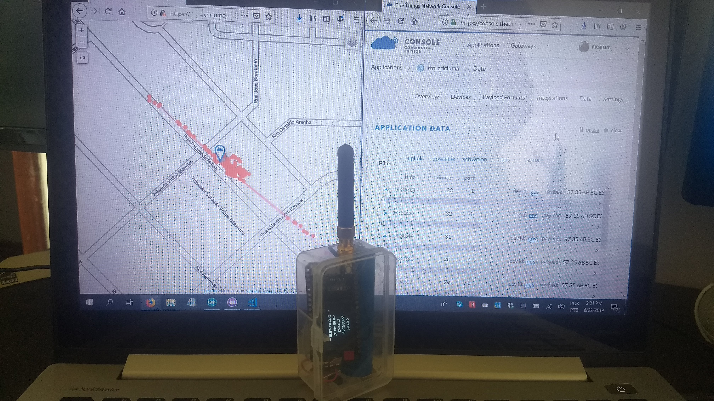
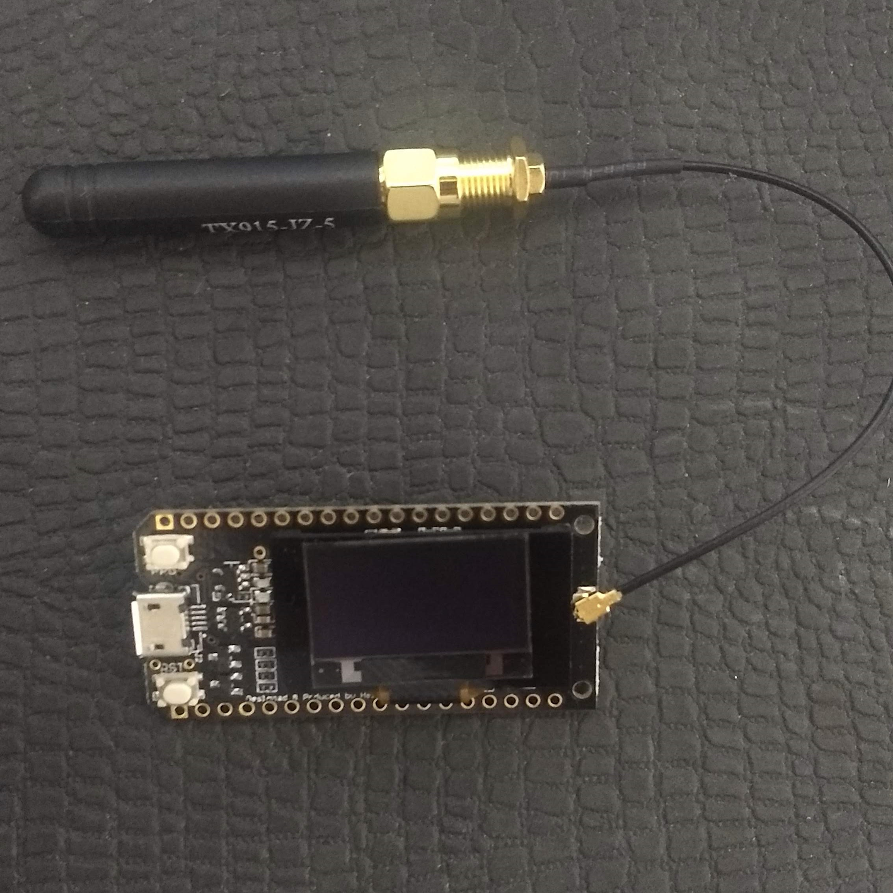
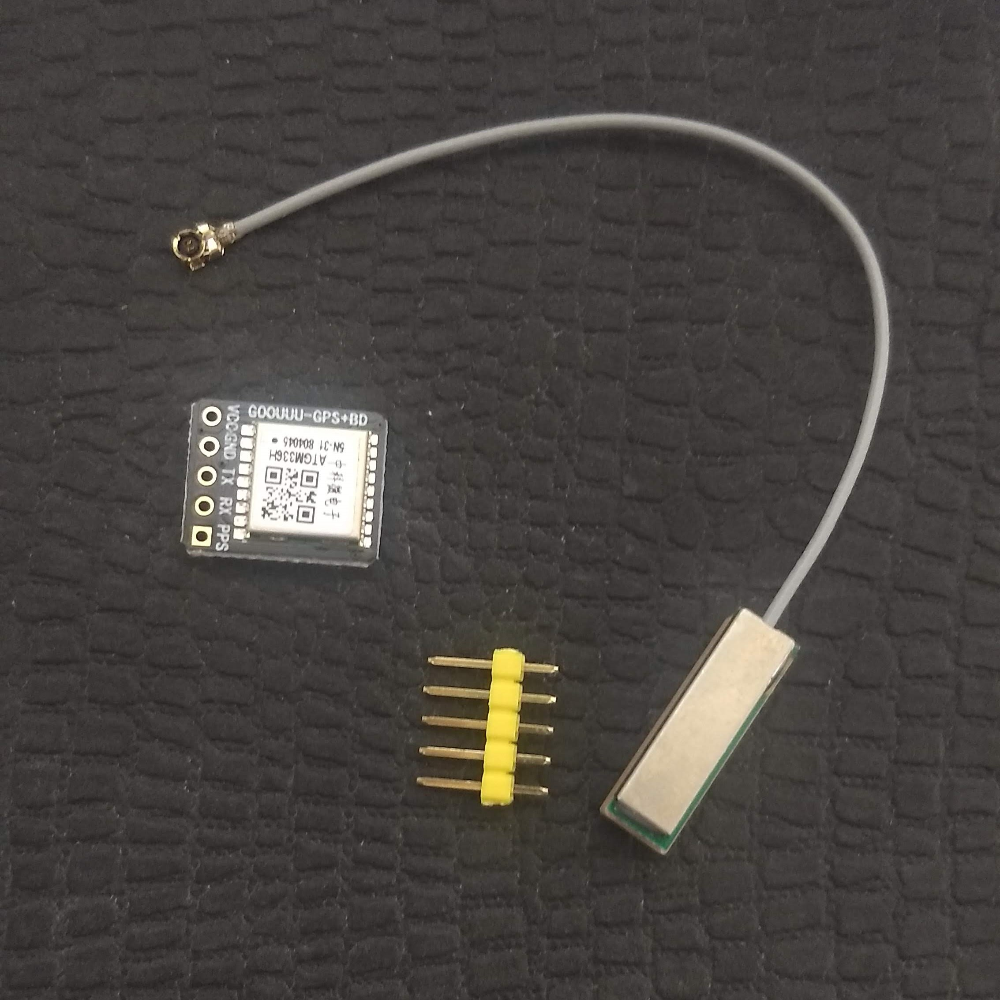
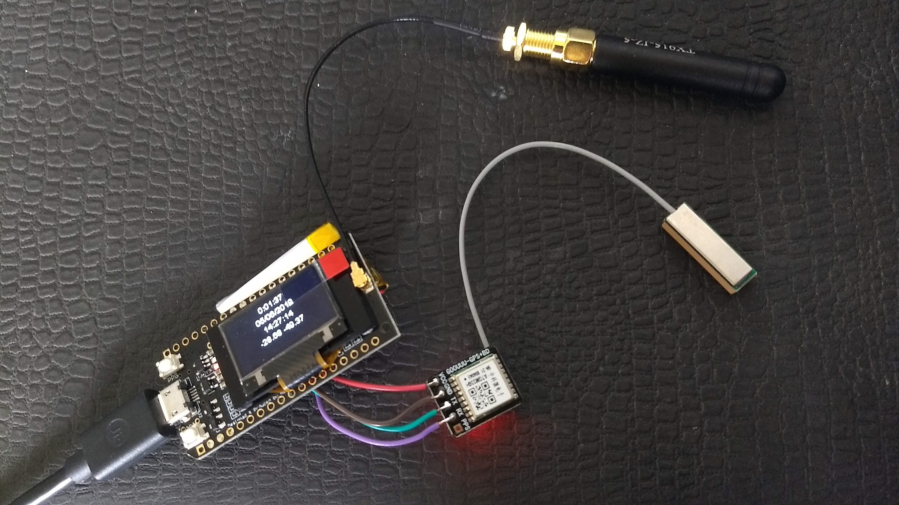
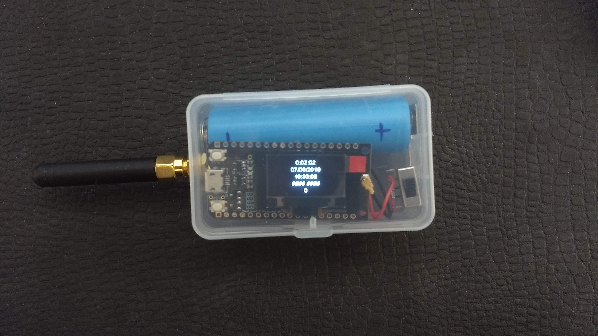
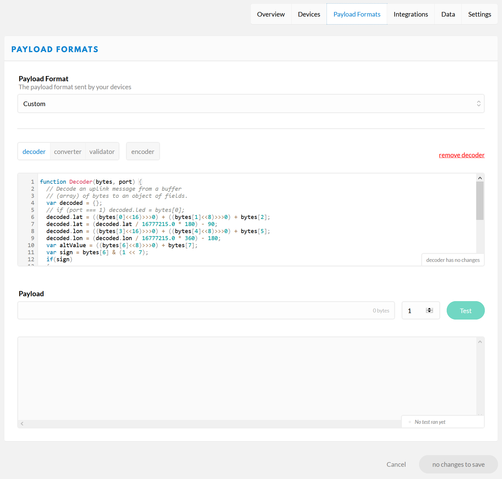
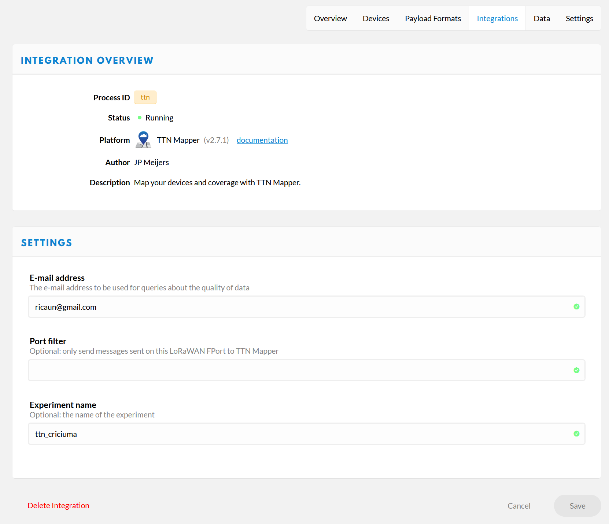
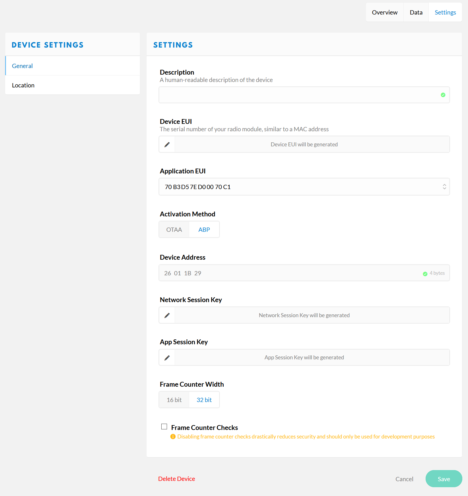
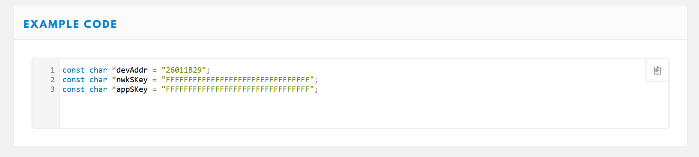

# esp32-ttnmapper-gps

Program to make a LoRaWAN node based on the TTGO LoRa 915MHz plus GPS (ATGM336H). The code is configured to connect to [The Things Network](https://www.thethingsnetwork.org/) using US frequency and send the gps values to the [ttnmapper](http://ttnmapper.org/)

[](https://travis-ci.org/ricaun/esp32-ttnmapper-gps)
[](LICENSE)



## Hardware

* TTGO LORA32 915Mhz (Heltec Wifi LoRa 32)
* GPS ATGM336H

### Images




### Schematic

| ESP32 | GPS |
| :----: | :-----: |
| 5V | VCC |
| GND | GND |
| 34 | TX |
| 35 | RX |

## Librarys

* [LMIC](https://github.com/mcci-catena/arduino-lmic)
* [ThingPulse OLED SSD1306](https://github.com/ThingPulse/esp8266-oled-ssd1306)
* [TinyGPSPlus](https://github.com/mikalhart/TinyGPSPlus)

## The Things Network

### Application Configuration

First it's a good idea to create a new application, them go on Payload Formats and put the code below.



```java
function Decoder(bytes, port) {
  // Decode an uplink message from a buffer
  // (array) of bytes to an object of fields.
  var decoded = {};
  // if (port === 1) decoded.led = bytes[0];
  decoded.lat = ((bytes[0]<<16)>>>0) + ((bytes[1]<<8)>>>0) + bytes[2];
  decoded.lat = (decoded.lat / 16777215.0 * 180) - 90;
  decoded.lon = ((bytes[3]<<16)>>>0) + ((bytes[4]<<8)>>>0) + bytes[5];
  decoded.lon = (decoded.lon / 16777215.0 * 360) - 180;
  var altValue = ((bytes[6]<<8)>>>0) + bytes[7];
  var sign = bytes[6] & (1 << 7);
  if(sign)
  {
    decoded.alt = 0xFFFF0000 | altValue;
  }
  else
  {
    decoded.alt = altValue;
  }
  decoded.hdop = bytes[8] / 10.0;
  return decoded;
}
```

Next go on integration and add a integration TNN Mapper. (It's a good idea to add a experiment name)



With the experiment name is possible to check only the experiment [criciuma](https://ttnmapper.org/experiments/map.php?name=criciuma).
More information on the [TTN Mapper Documentation](https://www.thethingsnetwork.org/docs/applications/ttnmapper/).

### Node

Create a new device and goes to setting, change the Activation Method to ABP and disable the Frame Counter Check, them save.



Next goes to Overview on the bottow Example Code.



Copy the code and replace on the sample code (esp32-ttnmapper-gps.ino).

If your board is diferent from the `Heltec Wifi LoRa 32` you should check the pins connection on `lmic_pins`.

----

Do you like this? Please [star this project on GitHub](https://github.com/ricaun/esp32-ttnmapper-gps/stargazers)!

